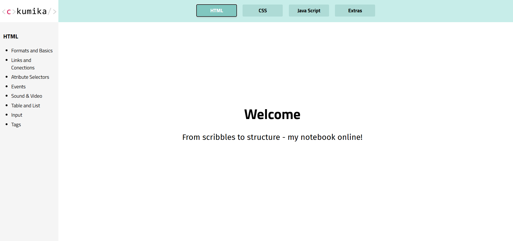

<h1>📒 Ckumika</h1>

  <strong>Ckumika</strong> is my <strong>first-ever side project</strong>, created during my coding course.
  It is a personal website that serves as my <strong>online notebook</strong>, where I collect and organise
  everything I’ve learned while studying web development.

<h2>✨ About the Project</h2>

  The goal of this project was simple:
  to build a place where I can <strong>practice</strong>, <strong>experiment</strong>, and
  <strong>remember</strong> core web development concepts.

<h2>Live Demo 🚀</h2>

You can try the game <a href="https://mikaridley.github.io/Ckumika/">here</a>

<h2>Preview 📸</h2>

  Inside the project, I documented and implemented:

<ul>
  <li>JavaScript concepts</li>
  <li>HTML structure and semantics</li>
  <li>CSS styling and layouts</li>
  <li>Extra exercises, notes, and small experiments from the course</li>
</ul>

  This project helped me turn theory into practice and understand how everything connects in a real website.

<h2>🛠️ Tech Stack</h2>

<ul>
  <li><strong>HTML</strong></li>
  <li><strong>CSS</strong></li>
  <li><strong>Vanilla JavaScript</strong> (no frameworks)</li>
</ul>

<h2>🎯 Why This Project Matters</h2>

<ul>
  <li>My <strong>first independent project</strong></li>
  <li>Built from scratch without libraries or frameworks</li>
  <li>Strengthened my understanding of frontend fundamentals</li>
  <li>Acts as a long-term reference for concepts I’ve learned</li>
</ul>

<h2>🚀 What I Learned</h2>

<ul>
  <li>How to structure a website from scratch</li>
  <li>Writing clean and readable JavaScript</li>
  <li>Styling layouts with CSS</li>
  <li>Thinking like a developer and solving problems independently</li>
</ul>

<h2>📌 Future Improvements</h2>

<ul>
  <li>Add more organised sections as I learn new topics</li>
  <li>Improve UI and responsiveness</li>
  <li>Refactor and clean older code as my skills grow</li>
</ul>
